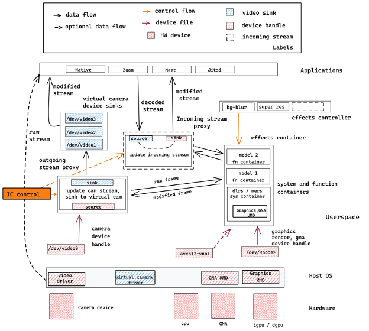

# Intelligent Collaboration Application

The Intelligent Collaboration application enables a user to modify their camera stream using AI models. The solution  enables 
functionalities such as background blur, video segmentation, etc., using corresponding deep learning models during a live streaming session.The 
Intelligent Collaboration software has is designed on the Linux platform, and is scalable to Chrome and Windows Platforms, and is 
enabled on Intel hardware. It utilizes Intel hardware features with the system containers (Deep Learning Reference Stack), and function 
containers (Optimized and third party AI algorithms such as image stylization, object detection, and others), the incoming stream 
container, the video stream proxy container, and other architectural building blocks.



## Installation

These are the requirements:

- Python3
- Docker
- Docker compose >= 1.27.4

**Note**

> Docker, Python3 and the required python packages are installed during the docker-compose installation.

This is the command to install these dependencies in Ubuntu 20.04:

```bash
sudo apt install docker-compose
```

**Note**

> Docker Compose in Ubuntu 20.04 comes with all the dependencies.
Docker Compose version in Ubuntu 18.04 is 1.17, which is not supported, you will need to install it from source, and install the rest of the dependencies manually.


### `v4l2loopback` kernel module

In order to make it work you will be required to install a third-party
kernel module. Below we have shown how that can be done on some common Linux distributions. The `v4l2loopback` is a kernel module to create V4L2 (Video4Linux) loopback devices that will serve for streaming our filtered video content.

- **Ubuntu**
```
sudo apt install v4l2loopback-dkms
```

- **Fedora**
```
sudo dnf install 'dnf-command(copr)'
sudo dnf copr enable sentry/v4l2loopback
sudo dnf install v4l2loopback
```

- **ArchLinux**
```
sudo pacman -Sy v4l2loopback-dkms
```

- **Install from source**

We have a [script](./services/video_device_manager/scripts/install_virtual_camera.sh)
with the automation for installing from source code
```
./services/video_device_manager/scripts/install_virtual_camera.sh
```

## Notes

**Hardware configuration used for this application demonstration:**

- 11th Gen Intel(R) Core(TM) i7-1185G7 @ 3.00GHz
- 16 G RAM
- 938 SSD
- Ubuntu 20.04.2 LTS (GNU/Linux 5.9.0-050900-generic x86_64)
- Docker, Server Version: 20.10.7
- Chrome Version 91.0.4472.114 (Official Build) (64-bit)
  - ***Due to differences in getUserMedia function between Chrome and Firefox this project is only compatible in Chrome.***

**Known issues:**

Some people have experienced issues when `secure boot` is enabled, you
can take a look in the following link for guidance. In some cases, the
only solution is to disable `secure boot` in BIOS.

- [Unsigned v4l2loopback module leads to error](https://github.com/umlaeute/v4l2loopback/issues/306)


## Usage

### Startup services

The script to interact with Intelligent Collaboration is `icollab.py`, there are 6 supported actions:

`start` - Initializes and start all Intelligent Collaboration basic services.

`stop` - Stops all running Intelligent Collaboration services.

`down` - Stops and removes all Intelligent Collaboration services and
containers.

`list` - Lists all running services originated from current project directory.

`clean` - Removes temporary directory where models are saved.
          By default, this script will look for the models locally and will
          only attempt to download them if not found.

`help` - Display this help.

Syntaxis is as follows:

```bash
python icollab.py [start|stop|down|list|clean|help]
```

After initializing the app, you can take a look at the UI at <http://localhost:8080>.

By default the port 8080 is assigned to the UI and the port 8000 is assigned to the backend.
If you want to use different ports use the environment variables UI_PORT and BACKEND_PORT respectively.
Example:

```bash
UI_PORT=8081 BACKEND_PORT=8001 python icollab.py start
```

## Contributing

We'd love to accept your patches, if you have improvements to stacks,
 send us your pull requests or if you find any issues, raise an issue. 
Contributions can be anything from documentation updates to 
optimizations!


## Security Issues

Security issues can be reported to Intel's security incident response team via
https://intel.com/security.


## Mailing List

See our public mailing list page for details on how to contact us. You should only subscribe to the
Stacks mailing lists using an email address that you don't mind being  public.

