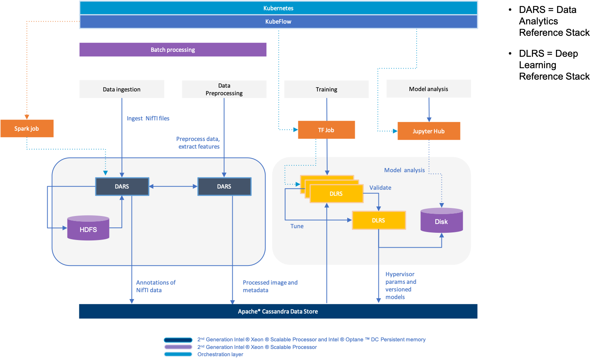

# ICH segementation using U-Net

This end-to-end use case uses the [Data Analytics Reference Stack](https://clearlinux.org/stacks/data-analytics) and the [Deep Learning Reference Stack](https://clearlinux.org/stacks/deep-learning) along with Apache* Cassandra* to walk through creating an AI pipeline to help radiologists detect intercranial hemorrhage (ICH). Using data at [PhysioNet](https://physionet.org/content/ct-ich/1.3.1/), we created a solution that can take computerized tomography (CT) images of the brain, process them to extract relevant data, and provide feedback to the radiologist, helping them to focus their examination on the relevant areas of the scan.

## Introduction

Detecting ICH is a serious condition often caused by traumatic brain injuries.  ICH must be diagnosed and treated as quickly as possible to avoid disability or death of the patient. This use case focuses on an open source solution using the System Stacks for Linux* OS to detect evidence of intracranial hemorrhage (ICH) to support medical diagnosis.



A complete description of the design and methodology of the use case can be found in the white paper entitled: Using AI to Help Save Lives: A Data-Driven Approach for Intracranial Hemorrhage Detection.

To walkthrough this use case yourself, follow the steps below.

### Prerequisites

1. You must have access to a Google Cloud Platform (GCP) project and be able to create a service account with the following roles: Cloud Trace Admin, Compute Admin, Compute Storage Admin, Kubernetes Engine Admin, Kubernetes Engine Cluster Admin, Service Account User, Service Management Administrator, Storage Object Admin.  Refer to the [GCP documentation] (https://cloud.google.com/iam/docs/creating-managing-service-accounts).   Be sure to create and download the service account keys; these must be defined inside the variables.tf file.

2. On your local system, clone the stacks-usecase repository:

```bash
git clone https://github.com/intel/stacks-usecase
```
Throughout this walkthrough we will refer to scripts in the healthcare/ich_segmentation directory of the repository just cloned. The "ich_segmentation" directory will serve as the root directory for the remainder of this walkthrough.


### Infrastructure

#### Setup

1. Install Terraform v0.12 on your local machine using these instructions https://learn.hashicorp.com/terraform/getting-started/install.html

2. Optionally install the Google Cloud SDK on your computer, this will allow you to connect with GCP directly from your terminal instead of using the Cloud Shell terminal or the Google Cloud web console to interact and query your resources https://cloud.google.com/sdk/docs/quickstart-linux

3. Edit the ich_segmentation/terraform/variables.tf file values accordingly once you have completed the setup steps in this section.

#### Deploy the Infrastructure

1. Initialize Terraform
```bash
cd ich_segmentation/terraform
terraform init
````

2. Retrieve a preview of resources to be created by starting Terraform
````bash
terraform plan
````

3. Start Terraform and enter *yes* when prompted
````bash
terraform apply
````

4. Review the terraform.tfstate file that was created when the infrastructure was deployed.

When the deployment is complete, you will have a cluster with three node pools ready to be configured.  Follow the propmts given onscreen to complete the setup.


### Orchestration

We are using Kubernetes* for orchestration, with a horizontally scalable cluster.  This gives us the ability to distribute training across multiple nodes, and can easily scale out for different workloads. Refer to the [Kubernetes documentation](https://kubernetes.io/docs/setup/production-environment/turnkey/gce/) for details on working with Kubernetes and GCP.


### Data Ingestion with DARS

The preprocessing task executed by Apache* Spark* consists of consuming large amounts of CT scan images that are first transformed into PNG images and then organized into a series. Together the PNG images represent a 2D image of the brain with annotated segmentation information. The preprocessing includes cleaning, normalizing, and labeling of the images that are used to train a segmentation model. The resulting data set is stored in a database, ready to be retrieved by DLRS.

Follow these steps to deploy and operate DARS on Kubernetes to perform data ingestion.

#### Setup the  infrastructure

1. Create and attach a persistent storage disk for pods in Kubernetes using the Google Cloud console. Be sure to mount the disk in `/mnt/disks/data`. More information can be found in the [GCP documentation](https://cloud.google.com/compute/docs/disks/add-persistent-disk).

2. Download the training data set from https://physionet.org/content/ct-ich/1.3.1/ and unpack it into `/mnt/disk/data`

3. Copy the Python requirements file located at: `/ich_segementation/requirements.txt`  into the disk at `/mnt/data/requirements.txt`.

3. Unmount and detach the disk from the VM. More information can be found in the [GCP documentation](https://cloud.google.com/sdk/gcloud/reference/compute/instances/detach-disk)

#### Deploy Spark on YARN cluster with Kubernetes.

1. Define the Kubernetes namespace for the DARS deployment by setting the environment variable `NAMESPACE="dars"`

2. Start the Spark on YARN deployment

  ````bash
  cd /ich_segmentation/dars/K8s
  make
  ````    

3. Wait until all the pods are up and running. You can verify all the pods are 1/1 state with this with command:

    ````bash
    kubectl --watch get pods -n $NAMESPACE’
    ````

#### Launch the main application

1. Navigate to the dars folder and copy the file: `hc_preprocessing_insertion_cassandra.py` into the pod spark-dars-master-0:

   ````bash
   kubectl -n $NAMESPACE cp hc_preprocessing_insertion_cassandra.py spark-dars-master-0:/root/main.py
   ````

2. Enter into the spark-dars-master-0 pod and submit the task to the DARS cluster:
    ````bash
    kubectl -n $NAMESPACE exec -it spark-dars-master-0 bash
    spark-submit --master yarn --deploy-mode cluster /root/main.py
    ````      

Note the inserted records in the Cassandra database to verify the steps completed successfully.


### Data Storage

The Apache Cassandra database pods within the cluster are used throughout the pipeline. They maintain the metadata on the dataset, save the processed images to object storage, and can manage storage of trained model objects.


#### Deploy the Cassandra Cluster

##### Prerequisites

You must have a nodepool with storage SSDs attached to each Kubernetes node.  The mount point of the SSDs must be the same on all nodes.

#### Creating local volumes on Kubernetes

1. Navigate to `/ich_segmentation/cassandra/deploy-local-storage-chart`

2. Modify the `values.yaml` file to specify the common mount point for the persistent storage on the Kubernetes.

3. Configure the hostnames of the given nodes.

4. Run:
   ````bash
   helm install ./
   ````

#### Deploy a Cassandra cluster on Kubernetes

1. Navigate to `ich_segmentation/cassandra/cassandra-upstream-chart`

2. Modify the `values.yaml` file according to your deployment.

3. If you want to provide custom configuration you should modify files/conf/cassandra.yaml. Remember to match seed addresses to the name of your helm deployment otherwise the nodes should not be able to reach each other in the cluster.

4. If you enabled encryption on `values.yaml`, create encryption certificates using `files/conf/create-encryption-certs.sh`

5. Run:
   ````bash
   helm install --name <deployment-name> --namespace <namespace-name> ./
   ````

#### Create the keyspace on the Cassandra cluster

1. Navigate to `ich_segmentation/cassandra/cql`

2. Create the database using the Cassandra `qlsh` client

   ````bash
   qlsh -f ./healthcare-keyspace.cql
   ````

### DNN Training

There are two types of training in the use case repo: local and cloud.
Local training uses a local version of the data for training, while
cloud training pulls from a database in the same cluster described above.

Cloud training uses a standard U-Net model and training callbacks are implemented to dynamically adjust training parameters.  
A custom-built generator is used to feed data during training to overcome memory constraints in the cloud training scenario. The local version uses the TensorFlow* datasets API

After training the model is exported to GCP Cloud Storage

#### Training a DNN using Kubeflow and TensorFlow

Training of the network is orchestrated as mentioned above on a Kubernetes cluster using TfJob and Kubeflow.

We specify a training job in a custom YAML file that references the TFJob CRD as shown below:

````yaml
apiVersion: kubeflow.org/v1
kind: TFJob
metadata:
  name: tfjob-hc
  namespace: kubeflow
spec:
  tfReplicaSpecs:
    PS:
      replicas: 1
      restartPolicy: OnFailure
      template:
        spec:
          containers:
          - name: tensorflow
            image: <your-image>
            command:
              - python
              - main.py
    Worker:
      replicas: 3
      restartPolicy: OnFailure
      template:
        spec:
          containers:
          - name: tensorflow
            image: <your-image>
            command:
              - python
              - main.py
    Master:
          replicas: 1
          restartPolicy: OnFailure
          template:
            spec:
              containers:
              - name: tensorflow
                image: <your-image>
                command:
                  - python
                  - main.py
````

To run a training job using a similar TFJob spec on a Kubernetes cluster:
````bash
kubectl apply -f <tfjob-training.yaml>
````

#### Cloud Training Instructions

1. Navigate to the `ich_segmentation` directory.

2. Create a Docker* image to use during training. A Dockerfile has been provided

3. Add a GCP credentials file in `ich-segmentation/`. Find more information in the [GCP documentation](https://cloud.google.com/docs/authentication/getting-started)

4. Edit the Dockerfile to copy your authentication file into the Docker image.

5. Connect the data loader with the Cassandra database.
   1. Find the IP address of the Cassandra nodes with `kubectl -n cassandra get pods -o wide`
   2. Add an IP address to the `cloud_generator` function in `utils/data_loader.py`. Any IP address will do.

The Docker image will need to be publicly hosted so Kubeflow can access it. Though there are multiple solutions, such as private repos and DockerHub*, given that this use case uses GCP the obvious hosting choice is Google Container Registry. Instructions on how to host a container are found in the [GCP documentation](https://cloud.google.com/container-registry/docs/pushing-and-pulling)

6. Edit `tfjob.yaml` to pull your hosted Docker image. You may also edit the number of worker nodes and several other parameters.

7. Edit the `utils/export_model.py` file to export the model to your desired GCP bucket.

8. Start the Kubeflow TFJob:
 ````bash
kubectl apply -f tfjob.yaml
````
#### Local Training Instructions

1. Navigate to the `ich-segmentation` directory
2. Download the dataset from https://physionet.org/content/ct-ich/1.3.1/
3. Unpack the dataset into the `ICH-UNET-2020` directory
4. Run the training
   ````bash
       python main.py --local
   ````
5. The model will be saved as a checkpoint in `models/checkpoints/` and will write or overwrite `models/unet.h5`


Local files are for prototyping and developing the solution and the core operation of local and cloud training is the same.

#### Local Inference Instructions

1. Extract compressed data from [physionet](https://physionet.org/content/ct-ich/1.3.1/) into the ICH-UNET-2020 directory
2. Run main.py with the '--infer' flag

    Note: There must be a model saved in 'models/checkpoints/' named 'unet.h5'
```bash
python main.py --infer
```

There are additional options and flags available from `main.py`. For a full list, run
```bash
python main.py --help
```


### Mailing List

See our public [mailing list](https://lists.01.org/mailman/listinfo/stacks) page for details on how to contact us. You should only subscribe to the Stacks mailing lists using an email address that you don't mind being public.

### Reporting Security Issues
Security issues can be reported to Intel's security incident response team via https://intel.com/security.
