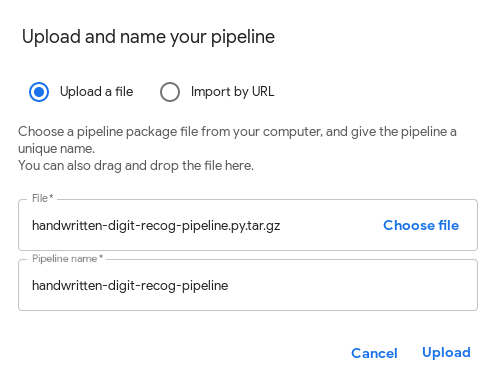
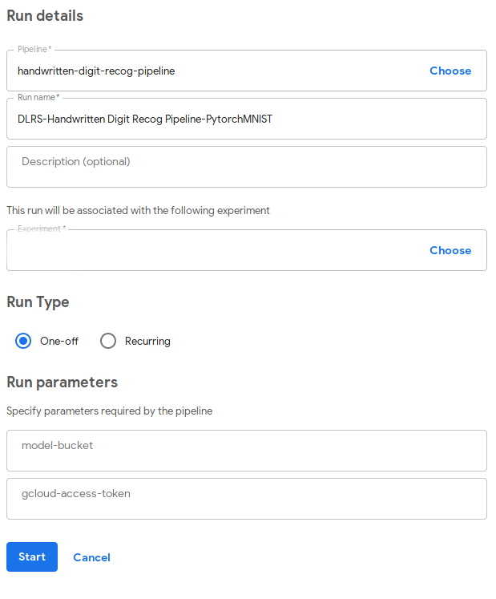
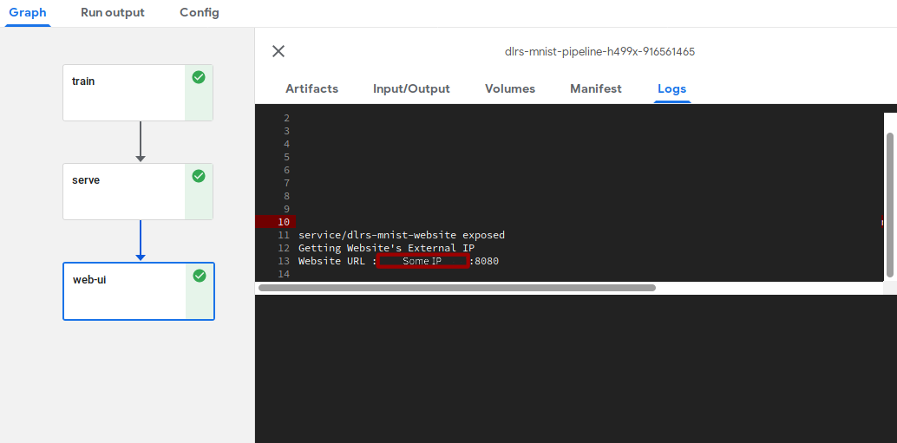

# MNIST Kubeflow Pipeline on DLRS

The following document describes how to run the Pytorch MNIST example on Kubeflow Pipelines on Google Cloud Platform (GCP).

## Prerequisites

* A [GCS bucket](https://cloud.google.com/storage/) to hold a Pytorch trained model. 
* A Kubernetes deployment on GKE (v1.12.10-gke.20)
* A Kubeflow deployment on GKE (v0.6.1)
* Docker
* All images in the [Pytorch MNIST example](https://github.com/intel/stacks-usecase/tree/master/handwritten_digit_recog) already built and available in accessible registry

## Host set up

Kubeflow Pipelines must be compiled into a domain-specific language (DSL). Please follow these steps to set up the machine were you will be compiling all pipelines.

The following commands will set up a virtual environment for Kubeflow Pipelines to work.

```bash
# In case you don't have conda already

wget https://repo.continuum.io/miniconda/Miniconda3-latest-Linux-x86_64.sh
bash Miniconda3-latest-Linux-x86_64.sh

# Create and activate the mlpipeline virtual environment 
conda create --name mlpipeline python=3.7
conda activate mlpipeline

# Install Kubeflow Pipelines SDK and other dependencies
wget https://raw.githubusercontent.com/kubeflow/examples/master/pipelines/mnist-pipelines/requirements.txt
pip install -r requirements.txt --upgrade
```

## Modify files

All files in this repository have fields that you have to manually edit. Before running any `docker build` command make sure you have already modified the following:

```bash
# Replace REGISTRY and TYPE where needed in handwritten-digit-recog-pipeline.py
  image='REGISTRY/dlrs-train-TYPE'
# Replace REGISTRY and TYPE where needed in all yaml files inside manifests/
  image: REGISTRY/dlrs-serve-TYPE
```

## Compile the Handwritten Digit Recognition Pipeline

Pipelines are written in Python, but they need to be compiled into a DSL, after activating the `mlpipeline` virtual environment, run the following command:

```bash
python3 handwritten-digit-recog-pipeline.py
```

This will produce a compiled `handwritten-digit-recog-pipeline.py.tar.gz` file.

## Running the pipeline

### Upload the pipeline through Kubeflow UI

Uploading the compiled pipeline using the UI is fairly easy. Hit the Upload pipeline button and follow the on screen instructions.



### Run the Handwritten Digit Recognition Pipeline

Start a new run and fill all the required fields.
This pipeline depends on two main user definitions:

* `model-bucket`: The GCS Bucket you already have (see prerequisites)
* `gcloud-access-token`: This is gcloud auth token, you can get it by running `gcloud auth print-access-token` on the Cloud Shell



This pipeline is comprised of three stages:

#### Train

The train stage will run `train.py`, which will train a Pytorch model using the MNIST dataset for handwritten digit recognition. The recently trained model will be then uploaded to the specified GCS Bucket.


#### Serve

The serve stage will expose an API that receives POST requests and calls `classify.py` for testing random handwritten digits.

#### Website

The last stage creates a service hosting a simple Web UI that makes calls to the model server (see previous stage) for testing random handwritten digits.

After all three stages of the pipeline finish, you can interact with the Web UI by going to the URL specified in the logs of the `web-ui` stage.


