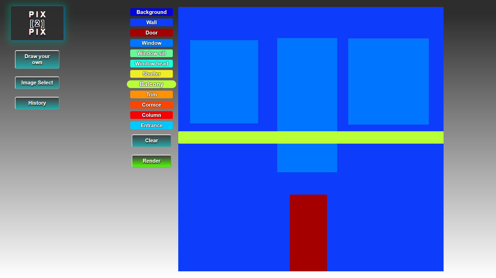

# PIX 2 PIX

Artists are faced with the challenge of effectively synthesizing photos from label maps, reconstructing objects from edge maps or colorizing images, among other tasks. Pix2pix is a fun, popular cGAN deep learning model that, given an abstract input, can create realistic outputs for use in art, mapping, or colorization. The pix2pix architecture is complex, but utilizing it is easy and an excellent showcase of the abilities of the Deep Learning Reference Stack. 



The code has been developed in such a way that, any new dataset can be easily added and the cGAN trained with it. We are also opensourcing a web front-end, components to deploy pix2pix inference as a function as service with openfaas as well.


### Instructions

#### Set up
1. If you have not done so already, clone the usecases repo into your local workspace
```bash
git clone https://github.com/intel/stacks-usecase
```
```bash
cd usecases/tensorflow/pix2pix
```
2. Run the Deep Learning Reference Stack (DLRS)
```bash
docker run -it -v ${PWD}:/workdir clearlinux/stacks-dlrs-mkl
```
3. Navigate to the github usecase and install requirements
```bash
cd /workdir
```
```bash
pip install -r requirements.txt
```
4. Download the data and process it
```bash
python scripts/get_data.py
```
```bash
python scripts/split.py
```

#### Training
Run training
```bash
python main.py
```

If you want to adjust hyperparamaters like cycles, epochs, and batche_size, or even train the discriminator or generator separately, add them as arguments. For example:
```bash
python main.py
or
python main.py --model continue --size_batch 12 --cycles 200
```

Available options are:
* model (string)
    * continue - run models named 'generator_model.h5' and 'discriminator_model.h5' in the 'models' directory
    * checkpoint - run the latest model in the 'checkpoints' directory
* cycles (int)
* size_batch (int)
* check_freq (int)

For more information on what each option does, run:
```bash
python main.py --help
```


#### Inference
```bash
python infer.py <path to your image>
```


### Testing

- Move to pix2pix directory 
- Install test requirements using:

```bash
pip install -r test-requirements.txt
```

- Run 

```bash
python -m pytest
```

## Citation

The original pix2pix paper:
```
@article{pix2pix2017,
  title={Image-to-Image Translation with Conditional Adversarial Networks},
  author={Isola, Phillip and Zhu, Jun-Yan and Zhou, Tinghui and Efros, Alexei A},
  journal={CVPR},
  year={2017}
}
```

The owner of the facades dataset:
```
@INPROCEEDINGS{Tylecek13,
  author = {Radim Tyle{\v c}ek and Radim {\v S}{\' a}ra},
  title = {Spatial Pattern Templates for Recognition of Objects with Regular Structure},
  booktitle = {Proc. GCPR},
  year = {2013},
  address = {Saarbrucken, Germany},
}
```
